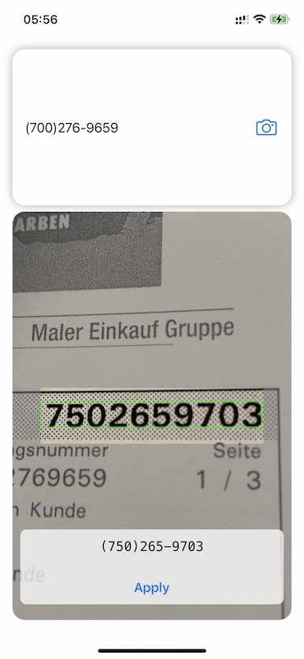

# StringDetector for iOS


## Introduction
The StringDetector for iOS is based on the sample code from Apples developer site avalable here: 
[Reading Phone Numbers in Real Time](https://developer.apple.com/documentation/vision/reading_phone_numbers_in_real_time). 

StringDetector for iOS provides a `StringDetector` protocol and default implementation `StringDetectorModel` class to separate UI from the data to detect with the iOS camera. 

The `StringDetectorView` is a SwiftUI compontent. See the Xcode StringDetectorExample App to detect US-style phone numbers using SwiftUI.

## Requirements

- Requires Xcode 12.5 or above
- See [Package.swift](Package.swift) for supported platform versions.

## Installation from Xcode 

Add a package by selecting `File` → `Add Packages…` in Xcode’s menu bar.

Search for the StringDetector iOS SDK using the repo's URL:
```console
https://github.com/utilem/string-detector-ios.git
```

Next, set the **Dependency Rule** to be `Branch` and specify `main`.

Then, select **Add Package**.

Choose the StringDetector package to add to your app.

## StringDetectorExample App

The example defines a `PhoneNumberModel` by overriding the default implementation of the `StringDetectorModel`:

```Swift
import SwiftUI
import Combine
import StringDetector

class PhoneNumberModel: StringDetectorModel {
    override var cameraZoomFactor: CGFloat { return 1.5 }
    override var cornerRadius: CGFloat { return 16 }
    override var regionOfInterest: CGSize { return CGSize(width: 0.7, height: 0.2) }
    
    override func isPossibleCanditate(string: String) -> (Range<String.Index>, String)? {
        return string.extractPhoneNumber()
    }
}
```
And a SwiftUI `ScannerView` to use the model.

```Swift
struct ScannerView: View {
    var model: PhoneNumberModel
    var scannerView: StringDetectorView

    init(model: PhoneNumberModel) {
        self.model = model
        self.scannerView = StringDetectorView(model: model)
   }

    var body: some View {
        scannerView
    }
}
```
The default implementation of the `StringDetectorModel` propagates changes on the string var using the following code:

```Swift
    @objc open var string: String? {
        willSet {
            self.objectWillChange.send()
        }
    }
```


## Author

Uwe Tilemann, Bonn

## License

See LICENSE folder for licensing information.
